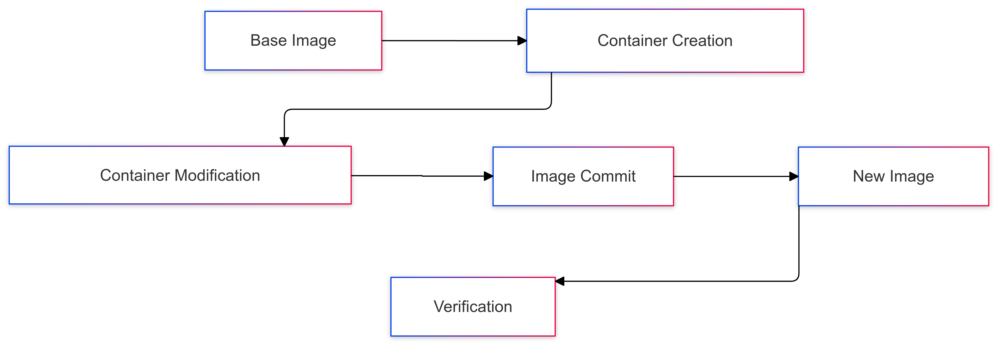

# 🐳 Docker Image Creation Master Class

[](https://github.com/TheToriqul/docker-image-from-container)


## 📋 Project Overview

This project demonstrates my expertise in Docker image creation and container manipulation, focusing on the sophisticated process of building new Docker images from modified containers. Through hands-on implementation, I've mastered the Union File System (UFS) concept and its practical applications in Docker containerization.

## 🎯 Key Objectives

- Master Docker image creation from existing containers
- Understand and implement Union File System (UFS) principles
- Develop proficiency in container modification and state management
- Learn effective Docker commit strategies
- Implement container cleanup and resource management

## 🏗️ Project Architecture

The project demonstrates the complete lifecycle of Docker image creation:

<figure >
  <p align="center">
      
      <p align="center">Project Architecture</p> 
  </p>
</figure>

## 💻 Technical Stack

- **Container Runtime**: Docker
- **Base Image**: Ubuntu Latest
- **Shell**: Bash
- **File System**: Union File System (UFS)

## 🚀 Getting Started

<details>
<summary>🐳 Prerequisites</summary>

- Docker Engine installed and running
- Basic understanding of Linux commands
- Terminal access
- Sufficient disk space for Docker images

</details>

<details>
<summary>⚙️ Implementation Steps</summary>

1. Create and modify a container:
   ```bash
   docker run -it --name hw_container ubuntu:latest /bin/bash
   touch HelloWorld.txt
   exit
   ```

2. Commit container changes:
   ```bash
   docker container commit hw_container hw_image
   ```

3. Verify the new image:
   ```bash
   docker run -it --name new_hw_container hw_image /bin/bash
   ls
   ```

For detailed commands and explanations, refer to the [reference-commands.md](reference-commands.md) file.
</details>

## 💡 Key Learnings

### Technical Mastery:
1. Advanced Docker container manipulation
2. Union File System (UFS) architecture and implementation
3. Docker image creation and management
4. Container state persistence
5. Resource cleanup and management

### Professional Development:
1. System architecture design
2. Infrastructure as Code principles
3. Container lifecycle management
4. Documentation best practices
5. DevOps workflow optimization

## 🔄 Future Enhancements

<details>
<summary>View Planned Improvements</summary>

1. Implement multi-stage builds
2. Add Dockerfile conversion capability
3. Integrate CI/CD pipeline
4. Add volume management examples
5. Include network configuration scenarios
6. Implement security best practices
</details>

## 📧 Connect with Me

- 📧 Email: toriqul.int@gmail.com
- 📱 Phone: +65 8936 7705, +8801765 939006
- 🌐 LinkedIn: [@TheToriqul](https://www.linkedin.com/in/thetoriqul/)
- 🐙 GitHub: [@TheToriqul](https://github.com/TheToriqul)
- 🌍 Portfolio: [TheToriqul.com](https://thetoriqul.com)

## 👏 Acknowledgments

- Thanks to the Docker community for their excellent documentation
- Special appreciation to [Poridhi](https://poridhi.io) for providing comprehensive learning opportunities

---

Thank you for exploring my Docker image creation project! This implementation demonstrates my practical understanding of Docker containerization and image management. Feel free to reach out if you have any questions or suggestions! 🚀